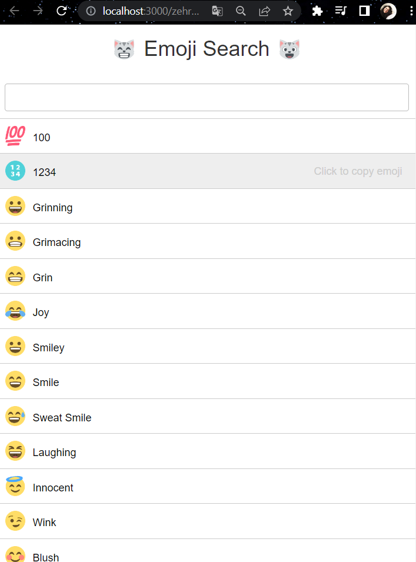
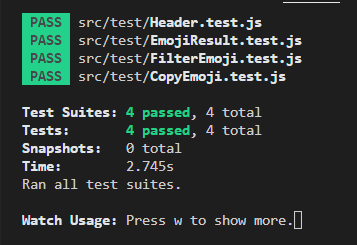

 Emoji Search with React Test
---
## Uygulama Görünümü

React'ın kendi dokümanlarında paylaşılan örnek projelerde bulunan ve halihazırda çalışan bir için uygulamanın test kodunu yazdım.

## Gereksinimler
* Başlık kısmının başarılı bir şekilde render edildiğini kontrol edecek olan test kodunu yazın.
* Uygulama ilk açıldığında emoji listesinin başarılı bir şekilde render edildiğini kontrol edecek olan test kodunu yazın.
* Bir filtreleme işlemi yapıldığında, emoji listesinin bu filtreye uygun şekilde yeniden render edildiğini kontrol edecek olan test kodunu yazın.
* Liste üzerinden herhangi emojiye tıklandığında, ilgili emojinin kopyalandığını kontrol edecek olan test kodunu yazın.

Bağımlılıkları yüklemek için
---

`npm install`

Projeyi çalıştırabilmek için
---

`npm start`

Test etmek için
---

`npm test`

## Test Sonuçları

[Orijinal Proje Github Linki](https://github.com/ahfarmer/emoji-search)